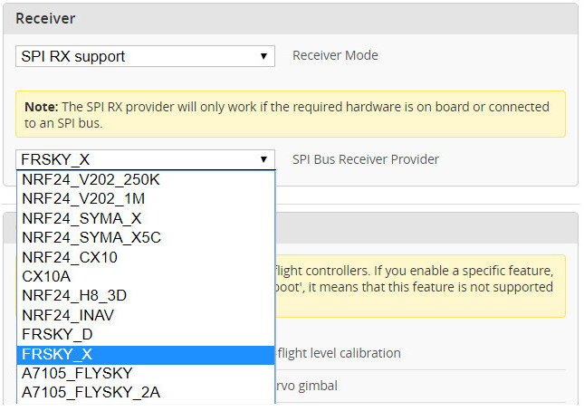

# The FrSky SPI RX

## Basics

'SPI RX' in the firmware is a framework that allows for radio chips to be connected directly to the flight controller's MCU, and to be controlled by the firmware. This allows for the implementation of the functionality that controls the radio chip, and translates the received signals into RC control signals as part of the firmware.

This has a number of advantages:
- the RX can be directly added to the flight controller board, allowing for smaller builds (after all, not many people want to use a flight controller _without_ an RX);
- it does not require one or more extra UARTs on the flight controller, and there is no risk of problems caused by a wrong UART configuration;
- it does not require an extra MCU to control the radio chip, and can therefore be produced / sold cheaper;
- since the RX 'firmware' is part of the flight controller firmware, fixes and updates will be applied as part of flight controller firmware updates, eliminating the need for (often cumbersome) RX firmware updates.

But there are also disadvantages:
- a flight controller board will only have one radio chip, and will only be able to support the RC protocols that are using this chip. Changing to a different protocol is often not possible.

## The FrSky SPI RX

This driver uses the SPI RX framework in the firmware to provide support for the FrSky 2.4 GHz RC protocols, based on a CC2500 radio chip, with additional support for a PA/LNA (power amplifier / low noise amplifier) chip with antenna diversity, in order to provide sufficient power / sensitivity for outdoor flying.

The supported protocols are:

### FrSky D

- 8 channels / 9 ms frame spacing;
- called 'D8' in OpenTX;
- integrated FrSky hub telemetry.

### FrSky X

- 8 channels / 9 ms frame spacing **or** 16 channels / 18 ms frame spacing;
- called 'D16' in OpenTX;
- integrated FrSky SmartPort telemetry (including support for MSP over Smartport / lua scripts in OpenTX);

### FrSky X LBT

- LBT protocol version compatible with EU;
- 8 channels / 9 ms frame spacing **or** 16 channels / 18 ms frame spacing;
- called 'D16' in OpenTX;
- integrated FrSky SmartPort telemetry (including support for MSP over Smartport / lua scripts in OpenTX);

## Configuration

1. in the Configurator, go to the 'Configuration' tab, in 'Receiver' box, select 'SPI RX support' for 'Receiver mode':

2. in the 'SPI Bus Receiver Provider' drop down that appears, select 'FRSKY_D', 'FRSKY_X' or 'FRSKY_X_LBT' (depending on the desired protocol):

3. click 'Save & Reboot'. After the reboot, the RX LED will confirm that the FrSky RX is active by blinking slowly;
4. enter bind mode by either:
- pressing the 'Bind' button on the flight controller (if there is one and it's reachable);
- entering CLI, and typing 'bind_rx_spi[Enter]'.
5. the flight controller will indicate that bind mode is active by changing the RX LED to be permanently on. Now, on your TX, enter bind mode for the selected FrSky protocol (see screenshots for OpenTX):

FrSky D protocol:

FrSky X and X_LBT protocol:

6. Once binding has completed, the flight controller will indicate this by blinking the RX LED slowly. There's no indication on the CLI, but you can observe successful binding by quitting the bind mode on TX, and seeing if `status` doesn't list RXLOSS anymore in "Arming disable flags". A reboot of the flight controller is not required.

## Tips & Tricks

- the RX bind information is stored in the following CLI parameters: `frsky_spi_tx_id` (internal TX id), `frsky_spi_offset` (frequency offset), `frsky_spi_bind_hop_data` (frequency hop sequence), and `frsky_x_rx_num` (RX number; FrSky X only). These are printed as part of a CLI `diff` / `dump`, and will be restored after a firmware update, making it unnecessary to do another bind after the update;
- resetting the above parameters to defaults will 'erase' the binding information;
- the CLI parameter `frsky_spi_autobind` can be enabled to configure the FrSky SPI RX to attempt a bind on every power up. This is mostly useful for demonstration models that should bind to whatever TX is powered up in the vicinity.

## Acknowledgements

- midelic for reverse engineering and reimplementation of the FrSky protocols;
- Eric Freund (eric_fre@hotmail.com) for the design of the first prototype flight controller with FrSky SPI RX.

## Boards with FrSky SPI RX

- [Midelic F3](https://github.com/betaflight/betaflight/wiki/Board-Midelic-F3) (prototype only, not commercially available);
- [Matek F411-ONE](http://www.mateksys.com/?portfolio=f411-one);
- [CrazyBee F3 FR](boards/Board%20-%20CrazyBeeF3FR.md);
- [CrazyBee F4 FR Pro](boards/Board%20-%20CrazyBeeF4FRPro.md);
- [BetaFPV F4]
- more to come...
